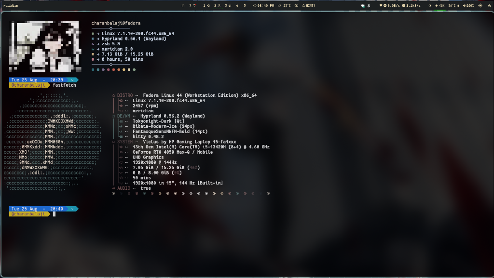

# 🚀 Meridian Terminal 2.0 — Cross-Platform Terminal & Developer Platform

[](https://github.com/charanbalaji2005/Meridian-Shell/actions/workflows/ci.yml)
[](https://charanbalaji2005.github.io/Meridian-Shell/)
[](https://www.gnu.org/licenses/gpl-3.0)
[](#)

**Meridian Terminal** is a modern Linux terminal emulator and developer environment with hardware-accelerated graphics, direct raster image rendering, live Git intelligence, interactive anime artwork galleries, multi-pane multiplexing, and built-in offline AI assistance.

📖 **Live Website & Documentation**: [https://charanbalaji2005.github.io/Meridian-Shell/](https://charanbalaji2005.github.io/Meridian-Shell/)

<p align="center">
  
</p>

---

> [!NOTE]
> ### 🤝 Contributors & Community Welcome!
> **Contributions of all kinds are warmly welcomed!** 
> Whether you want to:
> - 🐛 **Fix errors, bugs, or rendering glitches**
> - ✨ **Add new features, tools, or shell capabilities**
> - 🎨 **Contribute new anime themes, artwork, and visual enhancements**
> - ⚡ **Improve performance, terminal compatibility, or documentation**
> 
> Feel free to open an **Issue**, submit a **Pull Request**, or start a Discussion on GitHub. Every contribution helps make Meridian better for everyone!

---

## ⚡ Quick 1-Line Install, Update & Uninstall

### 1️⃣ Install Meridian

#### Universal 1-Line Installer (Fedora, Ubuntu, Debian, Arch Linux, etc.)
```bash
curl -fsSL https://raw.githubusercontent.com/charanbalaji2005/Meridian-Shell/main/install.sh | sudo bash
```

> **For User-Only Install (No `sudo` required, installs to `~/.local/bin`):**
> ```bash
> curl -fsSL https://raw.githubusercontent.com/charanbalaji2005/Meridian-Shell/main/install.sh | bash
> ```

---

### 2️⃣ Fedora & RHEL (`sudo dnf install`)

#### Option A: Direct DNF 1-Liner
```bash
sudo dnf install https://raw.githubusercontent.com/charanbalaji2005/Meridian-Shell/main/dist/meridian-terminal-2.0.0-1.fc44.x86_64.rpm
```

#### Option B: Enable Meridian DNF Repo
```bash
# 1. Enable repository
curl -fsSL https://raw.githubusercontent.com/charanbalaji2005/Meridian-Shell/main/setup_dnf_repo.sh | sudo bash

# 2. Install package directly with DNF
sudo dnf install meridian-terminal
# or:
sudo dnf install meridian-shell
```

---

### 3️⃣ Updating to Latest Release

Update anytime directly from your terminal:

```bash
meridian update
# or:
meridian upgrade
```

Or via curl 1-liner:
```bash
curl -fsSL https://raw.githubusercontent.com/charanbalaji2005/Meridian-Shell/main/install.sh | sudo bash
```

---

### 4️⃣ Uninstalling Meridian

```bash
# Clean uninstall via built-in CLI:
sudo meridian uninstall

# Or purge all user configurations (~/.config/meridian) as well:
sudo meridian uninstall --purge

# Or via curl 1-liner:
curl -fsSL https://raw.githubusercontent.com/charanbalaji2005/Meridian-Shell/main/uninstall.sh | sudo bash
```

---

## 🎨 Interactive Anime Theme Selector & Raster Image Commands

Meridian features a direct full-color inline raster graphics engine and an interactive anime theme switcher:

| Command | Action | Example |
| :--- | :--- | :--- |
| **`Ctrl+P`** or **`pic`** | Open interactive artwork gallery selector | `pic` |
| **`pic set <id\|number>`** | Set startup theme permanently | `pic set sharingan_eye`<br>`pic set 0`<br>`pic set sakura_girl` |
| **`pic set random`** | Rotate through all 14 themes on every startup | `pic set random` |
| **`pic set <file>`** | Set any custom image file permanently | `pic set ~/Pictures/anime.png` |
| **`pic <file>`** | Display raw full-color raster image directly | `pic tanjiro.png` |
| **`pic --debug <file>`** | Inspect decoded raster specs & GPU texture info | `pic --debug image.png` |
| **`pic --clear`** | Clear graphics from canvas | `pic --clear` |

### 🖼️ Available Built-in Themes

| Index | Theme ID | Description |
| :---: | :--- | :--- |
| **0** | `sharingan_eye` | Sasuke / Itachi Mangekyō Sharingan Eye (Raw Image) |
| **1** | `sakura_girl` | Sakura Blossom Anime Girl (Raw Image) |
| **2** | `ribbon_girl` | Monochrome Anime Ribbon Girl (Raw Image) |
| **3** | `fan_girl` | Anime Girl with Fan (Raw Image) |
| **4** | `itachi_sharingan` | Itachi Mangekyō Sharingan |
| **5** | `gojo_purple` | Gojo: Hollow Purple (Jujutsu Kaisen) |
| **6** | `sukuna_shrine` | Sukuna: Malevolent Shrine (Jujutsu Kaisen) |
| **7** | `naruto_rasengan` | Naruto: Kurama Rasengan |
| **8** | `rengoku_flames` | Rengoku: Sun Breathing Flames (Demon Slayer) |
| **9** | `ultra_instinct` | Goku: Ultra Instinct (Dragon Ball Super) |
| **10** | `chainsaw_man` | Chainsaw Man (Power & Denji) |
| **11** | `cyberpunk` | Cyberpunk Night (Lucy) |
| **12** | `synthwave` | Synthwave Horizon |
| **13** | `ghibli` | Studio Ghibli Anime Meadow |

---

## 📦 Multi-OS Distribution Packages

Download the package once and install completely offline on any machine:

### 1. Fedora / RHEL / CentOS / openSUSE (`dnf` / RPM)
```bash
sudo dnf install ./dist/meridian-terminal-2.0.0-1.fc44.x86_64.rpm
```

### 2. Ubuntu / Debian / Linux Mint (`apt` / DEB)
```bash
sudo dpkg -i ./dist/meridian-terminal_2.0.0_amd64.deb
```

### 3. Arch Linux / Manjaro / EndeavourOS (`pacman`)
```bash
cd packaging/arch && makepkg -si
```

### 4. macOS (Homebrew)
```bash
brew install --build-from-source packaging/macos/meridian-terminal.rb
```

### 5. Windows 10 / 11 (PowerShell & ConPTY)
```powershell
.\packaging\windows\install.ps1
```

---

## 🧪 Building & Testing

```bash
# Compile all targets
make all -j$(nproc)

# Run full test suite (126 unit & integration tests)
make test

# Generate all offline distribution bundles in dist/
./scripts/package_offline.sh
```

---

## 📄 License

Meridian Terminal is free and open-source software licensed under the **GNU General Public License v3.0 or later** ([GPL-3.0-or-later](LICENSE)).

